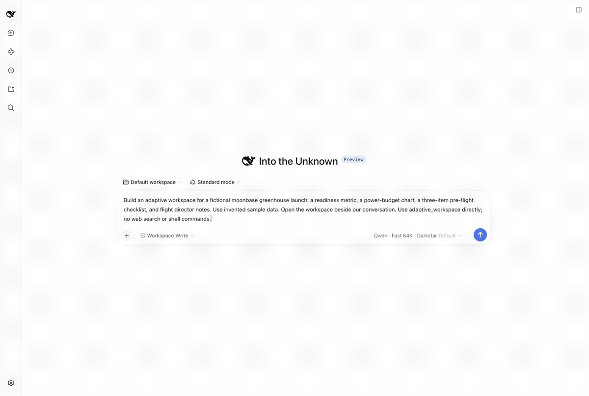
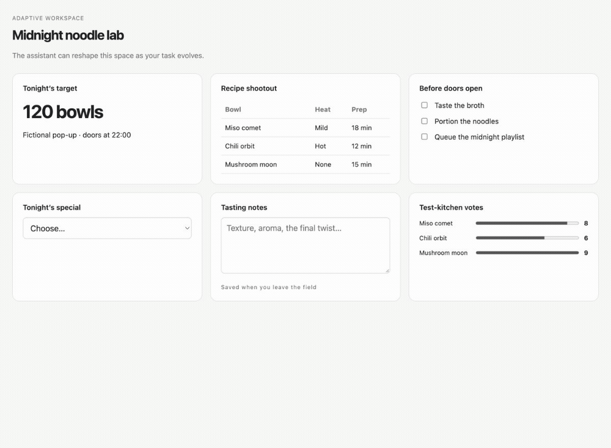
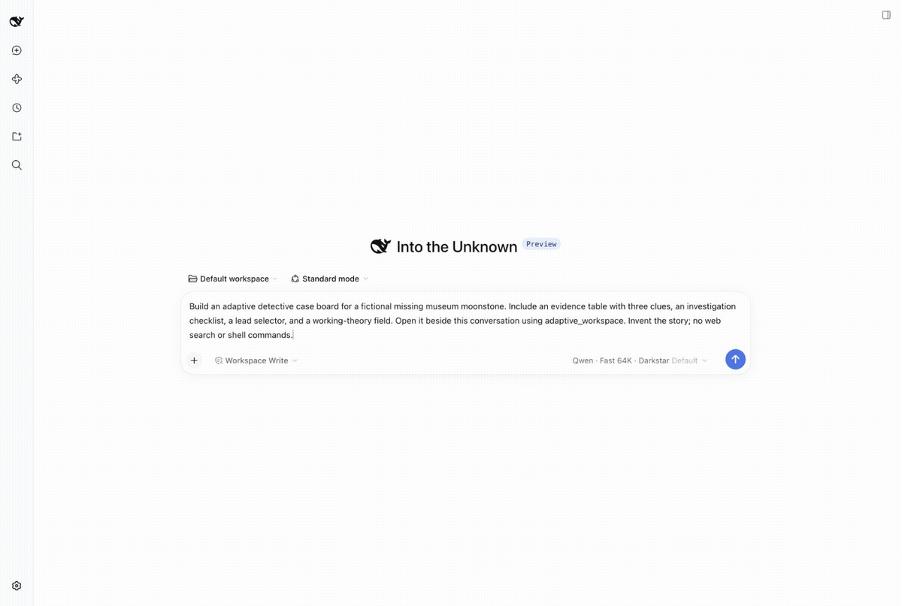

# Adaptive Workspaces for DeepSeek Harness

An installable, domain-neutral plugin that lets the model create and revise task-specific UI using **Vercel json-render**, alongside the original conversation. This is the self-adaptive presentation capability; it is not a video editor, a model provider, or a replacement Harness.

The model calls `adaptive_workspace` to discover the component catalog, open views, read persisted user input, and update layouts as the task evolves. The current catalog includes text, metrics, tables, bar charts, checklists, text inputs, and selectors. Research comparisons, planning boards, review forms and analysis dashboards use the same mechanism. User interactions persist and are visible to the model through `get_state`; they do not automatically submit a chat turn or execute external actions.

Views use validated json-render specs and trusted local components. Arbitrary HTML, scripts and remote widgets are rejected. The plugin starts/stops its own loopback renderer service and stores per-conversation views outside the package. Updates require a current revision to protect user edits. New specialist components can be added to `app/src/schema.ts` and the React registry in `app/src/main.tsx` and shipped as a new package version; the model can compose available components, not invent executable ones.

Model providers and domain tools are configured separately by the host. DeepSeek's branding, desktop, conversation, agent loop and existing tools remain unchanged.

## See it in action

Three live model-driven conversations in DeepSeek Harness: enter a prompt, submit it, and open an adaptive workspace beside the conversation. These GIFs use captured browser frames with generation waits and retry sequences cut for length; they do not imply instant or first-attempt generation. All example data is fictional, and the conversation-history sidebar is hidden.

### Moonbase launch room

A lunar greenhouse request becomes a mission workspace with readiness, power budgets, and a pre-flight checklist.



### Midnight noodle lab

A ramen pop-up request becomes a bowl comparison and preparation workspace. The final frame checks off a prep task in the generated UI.



### The missing museum moonstone

A fictional museum mystery becomes a compact text clue board alongside the conversation. The requested richer layout did not succeed in this run; the clip shows the smaller working result.



The moonbase and mystery runs needed follow-up prompts asking the model to use smaller payloads. Invalid JSON remains an experimental limitation; the recordings shorten those troubleshooting intervals. A later mystery checklist update also failed and is not included. The separate [`scripts/demo-fixtures.mjs`](scripts/demo-fixtures.mjs) file contains scripted sample data, not the source of these live-generated views.

## Build and install

```sh
npm ci
npm run build
npm test
npm pack --ignore-scripts
dsh plugin --profile web add /absolute/path/maxi-adaptive-workspaces-0.2.3.tgz
```

For Desktop, use its Plugins → Add plugin screen to install the tarball, click Enable now, then restart the desktop app to load the client extension. The source CLI does not manage the reserved desktop profile.

Configuration on the `adaptive-workspaces` row: `bridgeUrl` (loopback HTTP; bundled default port 3283), optional `dataDir` (defaults to `$DSH_HOME/adaptive-workspaces`). Set `HERO_HARNESS_ORIGIN` for a web origin other than port 3280. No credentials are included in the package.

Uninstall with `dsh plugin --profile web remove @maxi/adaptive-workspaces` (or your profile name); durable data is retained.

## Experimental preview

Requires Node.js 24+. Tested with DeepSeek Harness commit `5badb15009ae1756c3afe0ae0cef1faafc290ccc`. Other versions are not yet verified. The bundled patch registers only the plugin; it does not configure the host model, authentication, or network exposure.

Web views use the same-origin `/adaptive-workspaces` route with the host connection admission checks. Desktop views use the loopback renderer directly. Choose an unused bridge port. Stored data remains after uninstall.

Ask: “Build an adaptive workspace for comparing two proposals, with criteria and notes.” The model calls `get_catalog`, then `open_view` with a complete tree containing `root` and `elements`.

Invalid JSON is rejected; recovery currently depends on the model correcting its call. UI interactions save data but do not trigger a chat turn. The model composes the existing catalog; it cannot generate new executable components.

Build and test with `npm run check`. Tests cover validation, persistence, revisions, session isolation, and bridge requests. Full TypeScript checking additionally requires DSH workspace type packages. Web-proxy and cross-platform lifecycle coverage remain work in progress.

## Copyright

Copyright © 2026 Maxi Heavy Industries. All rights reserved.
